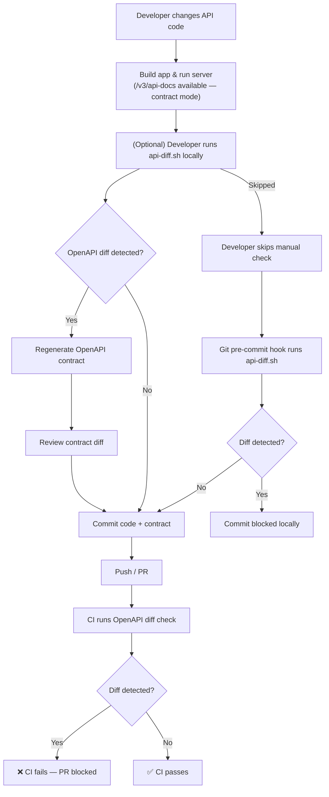

# API Contract

This project uses an OpenAPI-based contract to define the public API surface of the service.

The contract is generated at runtime from the application and committed to the repository to prevent accidental breaking changes.

[See Flowchart](#api-contract-flow)

---

## Contract Source

The API contract is generated from the following endpoint:

```bash
GET /v3/api-docs
```
The generated OpenAPI specification is stored as:
```bash
docs/design/api-contract.openapi.json
```
This file represents the **expected API contract** and is validated in CI.

---

## Contract Validation

1. [Manual Script](#manual-script)
2. [Automated Git Hook](#automated-githook)
3. [Automated CI](#automated-ci)

*The check fails if any backward-incompatible API change is detected.*

<h3 id="manual-script">1. Manual Script</h3>

Developers may run the same contract check locally before pushing changes:
```bash
scripts/api/api-diff.sh
```
This allows early detection of contract changes without waiting for CI.

---

<h3 id="automated-githook">2. Automated Git Hook</h3>

The contract check is integrated into a Git hook (e.g. `pre-commit`) to enforce validation automatically on each commit by using the same script as for `manual-check`.


This is intended for developer convenience; CI remains the source of truth.

<h3 id="automated-ci">3. Automated CI</h3>

During CI, the API is started in **contract mode** and the live OpenAPI definition is compared with the committed contract.

Validation steps:
1. Build the API JAR
2. Start the application with profile `contract`
3. Fetch `/v3/api-docs`
4. Compare with `api-contract.openapi.json`
5. Fail CI if differences are detected

Script:
```bash
scripts/ci/api-diff-ci.sh
```

---

## Contract Mode

Contract mode runs the application **without external infrastructure** (e.g. database).

- Database auto-configuration is disabled
- Database-backed services use stub implementations
- All API endpoints remain available

This ensures the API contract is **independent of infrastructure availability**.

---

## Updating the Contract

When API changes are intentional:

1. Update the application code
2. Regenerate the contract
3. Review changes
4. Commit the updated `api-contract.openapi.json`

CI will fail until the contract is updated.

---

<h2 id="api-contract-flow">Flowchart</h2>


