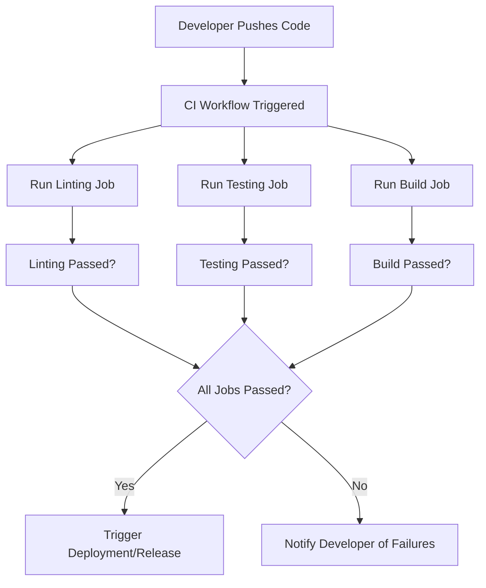

## Metadata

- Project: <name-of-project>
- Status: <Draft-In-Progress-Active-Superseded>
- Stage: <infra>
- Owner: <name-of-owner>
- Last Updated: <YYYY-MM-DD>

## Related Documents
<!--- Add links to related documents here. Remove non-relevant items. -->

- CI Pipeline Details 01
- CI Pipeline Details 02
- CI Troubleshooting Guide
- Contribution Guide
- Project Runbook

# CI Documentation Overview

## The first time Use  
- **Copy** this template to `docs/infra/ci/` and rename it appropriately for your project
- **Remove** this section after the first use

---

## Purpose
This document is the root entry point for CI documentation in this project.

Use it to:
- explain the CI strategy at a high level
- link to detailed pipeline docs
- document ownership, guardrails, and troubleshooting basics

Keep this document short. Put implementation details in linked docs.

---

## Scope
This CI documentation covers:

### In scope:

- workflow orchestration and execution rules
- quality gates and validation checks
- deployment or release automation (if applicable)
- local developer hooks that affect CI outcomes

### Out of scope:

- product requirements
- feature-level business decisions
- detailed implementation notes for non-CI systems

---

## CI Architecture Summary

### Entry workflows

- workflows: `path/to/workflows` - CI workflows that orchestrate the pipeline

- [ci.yml](<link-to-ci-yml>) - the main entry point for CI orchestration

### Reusable workflows

- workflows: `path/to/reusable-workflows` - reusable workflows that can be called by other workflows
- [<some-reusable-workflow>.yml](<link-to-reusable-workflow-yml>) - reusable workflow for <purpose>
- [<some-reusable-workflow>.yml](<link-to-reusable-workflow-yml>) - reusable workflow for <purpose>

### Supporting scripts/tools

- scripts: `path/to/scripts` - scripts used by CI workflows

- [script1.sh](<link-to-script1-sh>) - tools used by CI ... <name-of-workflow> workflows for <purpose> ...
- [script2.sh](<link-to-script2-sh>) - tools used by CI ... <name-of-workflow> workflows for <purpose> ...

### Local Hooks

- hooks: `path/to/hooks` - local hooks that run on developer machines to enforce CI rules
- [pre-commit](<link-to-pre-commit-hook>) - example pre-commit hook for linting and formatting
- [pre-push](<link-to-pre-push-hook>) - example pre-push hook for running tests before pushing code

## CI Flow Diagram
<!--Describe flow in high-level steps in both text and diagram form -->

### High-level steps
1. ... <!--Developer pushes code to the repository.-->
2. ... <!--CI workflow is triggered by the push event.-->
3. ... <!--CI workflow runs a series of jobs, including linting, testing, and building the application.-->
4. ... <!--If all jobs pass, the workflow may trigger deployment or release automation.-->

### Flow Diagram

## Workflow Catalog

***Status:** [Draft, In-Progress, Active, Superseded] 

| Workflow | Purpose | Trigger | *Status | Detail Doc |
|----------|---------|---------|--------|-------------|
| <workflow-name> | <brief-purpose> | <trigger-event> | <status> | [link-to-detail-doc](#) |

## Pipeline Decision Rules
<!--Document only the key rules the newcomer should know about the pipeline-->

- Rule 1: ... <!--E.g. when workflow runs-->
- Rule 2: ... <!--E.g. when workflow fails-->
- Rule 3: ... <!--E.g. when workflow is skipped-->
- Rule 4: ... <!--E.g. what must pass before merge-->
- Rule 5: ... <!--E.g. manual override or dispatch behaviour-->

## Required Checks
<!--These checks are set in Github to protect the main branch or other important branches-->

**Main Branch** 
- Check 1: ... <!--E.g. linting must pass before merge-->
- Check 2: ... <!--E.g. unit tests must pass before merge-->

**Other Important Branch** 
- Check 1: ... <!--E.g. integration tests must pass before merge-->

### Exceptions
<!--Document exceptions if any-->

## Local Development Contract

- prerequisites: ... <!--tools/runtime environment required for local development-->
- local validation commands: ... <!--commands to run locally to validate code before pushing-->
- local hook setup (if used): ... <!--instructions to set up local hooks for pre-commit or pre-push validation-->
- local hook behavior: ... <!--describe what the local hooks do and how they affect the CI process-->

## Failure Handling

### Common Failure Types
- Failure Type 1: ... <!--E.g. linting errors-->
- Failure Type 2: ... <!--E.g. unit test failures-->
- Failure Type 3: ... <!--E.g. build failures-->    

### First response Checklist
1. Read failing job logs
2. Confirm local environment prerequisites
3. Re-run local validation steps
4. Update affected artifacts and commit
5. Re-run CI

## Escalation Path
<!--not applicable for solo devs -->

## Change Management
Update this document when:
- a new workflow is added to the CI process
- an existing workflow is modified in a way that affects the CI process 
- trigger or gating logic is changed
- required checks are added, removed, or modified

Review cadence:
- <monthly or per major change>... - review this document for accuracy and completeness

---
