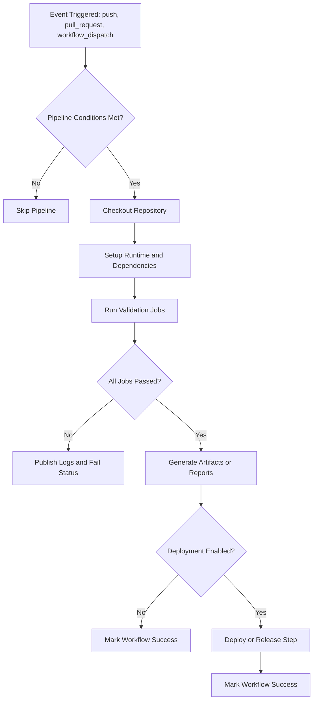

## Metadata

- Project: <name-of-project>
- Status: <Draft-In-Progress-Active-Superseded>
- Stage: <infra>
- Owner: <name-of-owner>
- Last Updated: <YYYY-MM-DD>

## Related Documents
<!--- Add links to related documents here. Remove non-relevant items. -->

- CI Documentation Overview
- Aditional pipeline doc
- CI Troubleshooting Guide
- Contribution Guide
- Project Runbook

---

# CI Pipeline Detail: [ciName]

## The first time Use
- **Copy** this template to `docs/infra/ci/` and rename it appropriately for your project
- **Link** to this document from the CI Documentation Overview doc for your project
- **Remove** this section after the first use

---

## Purpose
<!--Describe what this pipeline protects or verifies in 2-4 sentences.--><!--- E.g. This pipeline runs on every pull request to verify that the code meets quality standards and passes all tests before merging. -->

---

## Scope

### In scope:

- ... <what this pipeline does>
- ... <what this pipeline validates>
- ... <what this pipeline protects>
- ... <what artifacts it touches or produces>

### Out of scope:

- ... <what this pipeline does not do>
- ... <checks delegated to other pipelines>

---

## Pipeline Contract

### Inputs

- Trigger events: 
   - ...<!--e.g. pull request, push to main branch, scheduled run, workflow_dispatch, workflow_call, etc.-->
- Changed paths/filters:
   - ... <!--e.g. only run when files in `src/` or `docs/` change-->
- Required files/tools: 
   - ...<!--e.g. `requirements.txt`, `Dockerfile`, etc.-->

### Outputs

- Status checks produced: <!--e.g. build, test, lint, deploy, etc.-->
- Artifacts produced: 
   - ...<!--e.g. build artifacts, test reports, coverage reports, etc.-->
- Logs/diagnostics produced: 
   - ...<!--e.g. console logs, error messages, stack traces, etc.--> 

### Success Criteria
- ... <!--e.g. all tests pass, code coverage above threshold, no linting errors, etc.-->
- ... <!--e.g. deployment successful, artifacts generated, etc.-->
- ... <!--e.g. no critical errors, all required checks completed, etc.-->

### Failure Criteria
- ... <!--e.g. any test fails, code coverage below threshold, linting errors present, etc.-->
- ... <!--e.g. deployment fails, artifacts not generated, etc.-->   

---

## Triggers & Gating Rules

- ... <!--when pipeline runs-->
- ... <!--when pipeline is skipped-->
- ... <!--manual run behavior-->
- ... <!--dependency behavior using other pipelines (needs, etc.)-->
- ... <!--branch specific behavior-->

---

## Workflow Topology

- Entry workflow: ... <!--path to entry workflow-->
- Reusable workflows: ... <!--paths to reusable workflows-->
- Supporting scripts: ... <!--paths to supporting scripts or tools used in the pipeline-->
- Local hooks (if used): ... <!--paths to local hooks for pre-commit or pre-push validation-->

---

## Job Catalog

| Job Name | Purpose | Runs When | Depends On | Fails When | Artifacts Produced | Logs Produced |
|----------|---------|-----------|------------|------------|------------------|---------------|
| <job-name> | <brief-purpose> | <trigger-event> | <dependencies> | <failure-conditions> | [Link](<artifacts-path>) | [Link](<logs-path>) |

---

## Step-Level Logic Summary

### Job: <job-name>

1. ... <!--step 1 description-->
2. ... <!--step 2 description-->
3. ... <!--step 3 description-->
4. ... <!--validation / fail condition-->

---

## Flow Diagram
<!--Include a flow diagram of the pipeline, showing the sequence of jobs and their dependencies.-->
<!--This is example only. Replace with actual pipeline flow diagram -->

---

## Decision Notes:
<!--Include links to relevant discussions, PRs, or issues if applicable.-->

Capture key implementation decisions, trade-offs, rationale and why they were made for future reference.

- **Decision 1**: ...<What> 
   - Rationale: ...<Why>
   - Trade-offs:
      - Pro: ...<Pros>
      - Con: ...<Cons>

---

## Local Reproduction

### Prerequisites
- ... <!--tools/runtime environment required for local reproduction-->
- ... <!--dependencies required for local reproduction-->

### Run Steps
1. ... <!--command or action-->
2. ... <!--command or action-->
3. ... <!--expected result-->

### Common Local Pitfalls
- ... <!--common issues encountered during local reproduction and fix-->

---

## Failure Handling
<!--Describe how to handle failures in the pipeline, including common failure types, first response checklist, and recovery path.-->

### Common Failure Types

- <type 1>: <likely cause>
- <type 2>: <likely cause>
- <type 3>: <likely cause>

### First Response Checklist

1. Check failing job logs
2. Confirm local prerequisites
3. Re-run local validation
4. Update affected files/artifacts
5. Re-run CI

### Recovery Path

- Fast fix: <what to do for common case>
- Deep fix: <what to inspect for edge cases>

---

## Change Management
Update this document when:
- a new workflow is added to the CI process
- an existing workflow is modified in a way that affects the CI process 
- trigger or gating logic is changed
- required checks are added, removed, or modified

Review cadence:
- <monthly or per major change>... - review this document for accuracy and completeness

---
