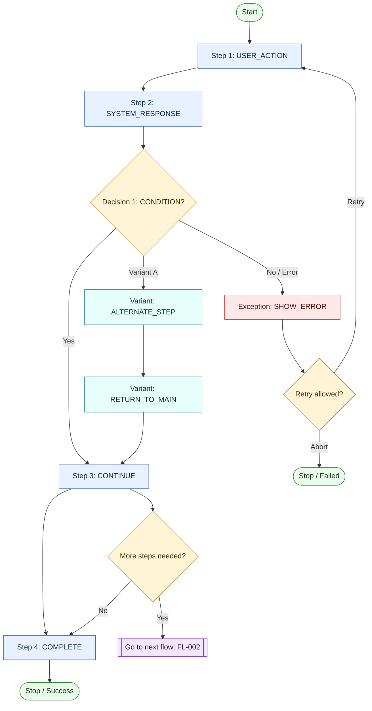
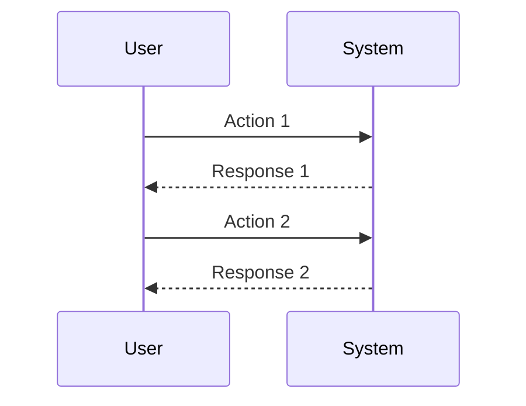

## Metadata

- **Project**: <name-of-project>
- **Status**: <Draft-In-Progress-Completed-Superseded>
- **Stage**: <discovery-delivery>
- **Owner**: <name-of-owner>
- **Last Updated**: <YYYY-MM-DD>

---

## Related Documents

- User Story: [US-XXX](<link-to-user-story>)

---

# User Flow [FL-XXX]: <Name of Flow>

## Purpose
<!-- One sentence why this flow exists. -->

## Trigger
<!-- What event or action initiates this flow? -->
<!-- Example: User clicks on "Sign Up" button. -->

## Steps Flow Diagram
<!-- Use the flow diagram template to create a flow diagram for this user flow. -->
**Complexity Guard:** 
If `Max-steps` > 8 or `Max-decision-points` > 3, split into second flow diagram and link to it in the references section.

## Sequence Diagram (Optional)
<!--Use sequence diagram only for edge technical cases. -->

## Success Criteria
<!-- Define 1-X measurable success criteria for this flow. -->
<!-- Example: 
1. User completes the flow in less than 3 minutes. 
2. User successfully completes the flow without errors. 
3. Exception case transfers the user to a support page with a contact form.
X. ...
-->

1. ...
2. ...
3. ...

## References
- Issue: <!--e.g. #123-->
- PR: <!--e.g. #456-->
- Wireframes: <!--e.g. [link-to-wireframes]-->
- Parrent Flow: <!--e.g. [FL-001](link-to-parent-flow)-->
- Child Flow: <!--e.g. [FL-002](link-to-child-flow)-->
