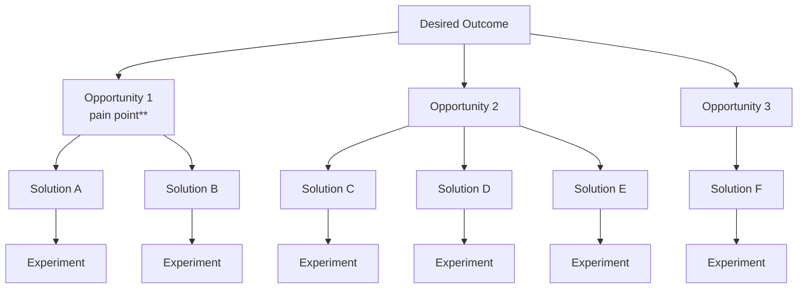

## Metadata

- **Project**: <name-of-project>
- **Status**: <Draft-In Progress-Completed-Superseded>
- **Stage**: <discovery>
- **Owner**: <name-of-owner>
- **Last Updated**: <YYYY-MM-DD>

---

## Related Documents

- Business Problem
- Problem Discovery
- Problem Statement

---

# Solution Space Exploration

## Problem Context

### Problem Statement
<!-- Link or copy the validated problem statement -->

> Help [target user] achieve [desired outcome] because currently [current behavior / pain].

---

## Exploration Goal

<!-- What are we trying to discover? -->

Example:

> Identify possible solution directions that could help junior developers retain technical knowledge.

---

## Solution Landscape
<!-- Explore different categories of solutions, not individual features yet -->

Reference: [Opportunity Solution Tree](#opportunity-solution-tree) as visualization of the solution landscape.

### Solution Direction 1: [Name]

#### Description

<!-- How does this approach solve the problem? -->

#### Examples / Existing Solutions

<!-- Existing products, research, competitors, patterns -->

-

#### Advantages

-

#### Limitations / Risks

-

---

### Solution Direction 2: [Name]

#### Description

-

#### Examples / Existing Solutions

-

#### Advantages

-

#### Limitations / Risks

-

---

#### Solution Direction 3: [Name]

#### Description

-

#### Examples / Existing Solutions

-

#### Advantages

-

#### Limitations / Risks

-

---

## Existing Solutions Research
<!-- What already exists in this space? E.g. existing products, research, competitors, patterns, services, solutions -->

| Solution | Approach | Strengths | Weaknesses | Relevant Learning |
|---|---|---|---|---|
| | | | | |

---

## Candidate Concepts
<!-- Concepts identified as potentially promising. No decision made yet. -->

-
-
-

---

## Next Step

Expected output:

- Create Solution Concept Selection artifact
- Continue research
- Gather additional evidence

---

## References

- Research:
- Competitor examples:
- Existing products:
- Articles/papers:

---

## Opportunity Solution Tree
<!-- Visualize the solution landscape and candidate concepts -->
<!--
Desired Outcome = Business relevant metric that you want to improve.
Opportunity = Pain point / problem that the user is experiencing.
Solution = Possible solution direction that could help the user achieve the desired outcome.
Experiment = Just a reference to the dedicated experiment that will validate the solution concept.
-->

