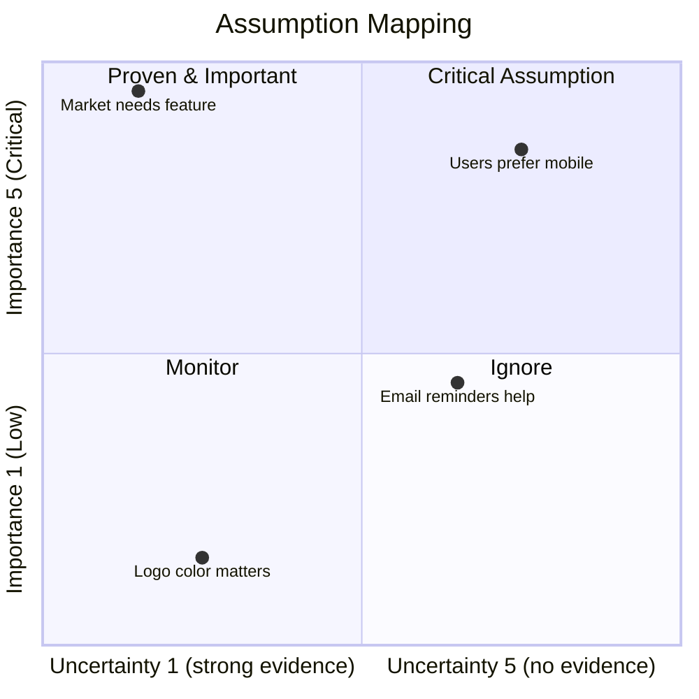

## Metadata

- **Project**: <name-of-project>
- **Status**: <Draft-In Progress-Completed-Superseded>
- **Stage**: <discovery>
- **Owner**: <name-of-owner>
- **Last Updated**: <YYYY-MM-DD>

---

## Related Documents

- Business Problem
- Problem Discovery
- Problem Statement
- Solution Space Exploration
- Solution Concept Selection

---

# Assumptions List

## Purpose
The purpose of this document is to capture all currently known product uncertainties and their associated assumptions and translate them into a `Assumption List` and `Assumption Mapping` to help prioritize the assumptions and identify the riskiest assumptions to focus on first.

## Assumption List

**Types to cover:**
- Desirability (Market, Users)
- Feasibility (Technology, Resources)
- Viability (Business Model, Revenue Streams)

**Uncertainty:**> 
`What we dont know?`

**Uncertainties --> Assumptions:** 
`What is our current belief (assumption) on this uncertainty?`

**Scoring** = [Link](#scoring)

| ID | Type | Uncertainty | (Belief) Assumption | Importance | Evidence | Risk if Wrong | Risk Level | Total Score |
| --- | --- | --- | --- | --- | --- | --- | --- | --- |
| AS-XXX | User | [UNC-XXX] - What we dont know? | What is the belief that you have about this uncertainty? | <1-5> | <1-5> | What is the risk if this assumption is wrong? | <1-5> | <1-125> |

---

## Detailed Assumption Notes (Optional)
<!--Use only for assumptions that require additional context or explanation-->

### AS-XXX: [Assumptions Title]

#### Assumption:

#### Further Details / Notes:

---

## Assumption Mapping
Visualize with a quadrant chart to help prioritize the uncertainties.
`belief(Assumption)` + `evidence` + `importance` = `assumption mapping(prioritization)` 

### Scoring:
- Importance Level:              
  - 1 - Low
  - 2 - Nice to have
  - 3 - Useful
  - 4 - Important
  - 5 - Critical
- Uncertainty Level (Evidence):
  - 1 - Almost certain (strong evidence)
  - 2 - Low uncertainty (some evidence)
  - 3 - Some uncertainty (limited evidence)
  - 4 - High uncertainty (little evidence)
  - 5 - Unknown (no evidence)
- Risk Level (Risk if Wrong):
  - 1 - None
  - 2 - Low
  - 3 - Medium
  - 4 - High
  - 5 - Critical

## References
- [product-discovery-guide-simple.md](#) <!--e.g. [Product Discovery Guide Simple](https://github.com/your-repo/blob/main/path-to-guide) -->
- Issue <!---e.g. #125-->
- PR <!---e.g. #220-->

## Next Steps
1. Translate the `Critical Assumptions` into `Assumption Backlog` and prioritize them in artifact `assumption-backlog.md` to focus on the riskiest assumptions first.
