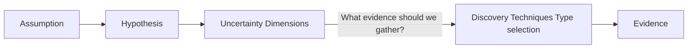
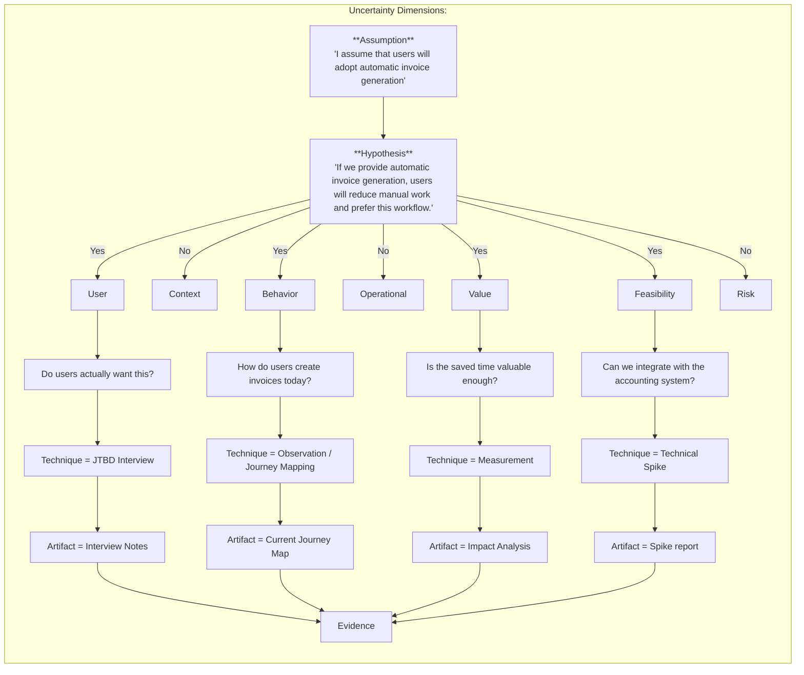

# Discovery Technique Guide

## ToC
1. [Purpose](#1-purpose)
2. [Uncertainty Dimensions](#2-uncertainty-dimensions)
3. [Concept Flow](#3-concept-flow)
4. [Discovery Techniques Type selection](#4-discovery-techniques-type-selection)
5. [Practical Process Example](#5-practical-process-example)

## 1. Purpose
The purpose of discovery techniques guide is to provide a explanation of process leading to appropriate discovery techniques selection. The guide is intended to help me understand the process and how to apply it in practice.

**Key Concept:  Discovery techniques are selected based on the type of uncertainty and the evidence needed to reduce that uncertainty.** 

**Core Model:** 
1. Why are we investigating?
   - Assumption
   - Hypothesis
2. What type of uncertainty exists?
   - User
   - Context
   - Behavior
   - Operational
   - Value
   - Feasibility
   - Risk
3. How do we investigate?
   - Technique
   - Artifact
   - Evidence

---

## 2. Uncertainty Dimensions

- User
  - Who is the user?
  - What matters to them?
- Context
  - In what situation the need/problem occurs?
- Behavior
  - What do users actually do?
- Operational
  - How is the system operated?
- Value
  - Does solving this create enough value?
- Feasibility
  - Can we realistically build and operate this?
- Risk
  - What can prevent success?

---

## 3. Concept Flow

Note that focus is on gathering right type of evidence to reduce uncertainty. That is the key for discovery techniques selection. 

---

## 4. Discovery Techniques Type selection 

Hereby are examples of discovery techniques selection based on uncertainty dimensions. The table is not exhaustive and is intended to provide a starting point for discovery techniques selection.

| Dimension | Key Question              | Sub-question  | Evidence Needed                   | Preferred Technique |
| --------- | ------------------------- | -------------------------------- | ------------------- | ------------------- |
| User      | Who is the user?          | Who is the target user? | User Segments | Personas            |
| User      | Who is the user?          | Are there different user groups? | User Segments | Personas            |
| User      | What matters to the user? | What are they trying to achieve? | User Goals          | JTBD Interview      |
| User      | What matters to the user? | What motivates them?             | User Motivations    | JTBD Interview      |
| User      | What matters to the user? | What outcome are they trying to achieve?   | Desired Outcome     | JTBD Interview      |
| Context   | In what situation does the need/problem occur? | When does the need/problem occur?                 | Timing |  Context Interview                     |
| Context   | In what situation does the need/problem occur? | Where does the need/problem occur?                | Location | Context Interview                     |
| Context   | In what situation does the need/problem occur? | What triggers the need/problem?     | Triggers     | Context Interview                     |
| Context   | In what situation does the need/problem occur? | What external factors influence the situation?    | External Factors | Context Interview                     |
| Context   | In what situation does the need/problem occur? | What constraints exist in the user's environment? | Constraints  | Context Interview / Constraints Notes |
| Behavior  | What do users actually do? | What steps do users perform to achieve their goal?   | Steps | User Journey Mapping               |
| Behavior  | What do users actually do? | What is the current workflow?                        | Workflow | User Journey Mapping               |
| Behavior  | What do users actually do? | Where do users experience pain or friction?          | Pain Points | User Journey Mapping               |
| Behavior  | What do users actually do? | What workarounds do users use today?                 | Workarounds | User Journey Mapping / Observation |
| Behavior  | What do users actually do? | Which tools or systems do users interact with?       | Tools | User Journey Mapping               |
| Behavior  | What do users actually do? | What information is created, consumed, or exchanged? | Information | User Journey Mapping               |
| Operational | How is the system operated? | Who operates the system?  | Responsibilities | Operational Notes                     |
| Operational | How is the system operated? | Who owns which responsibilities? | Ownership | Operational Notes                     |
| Operational | How is the system operated? | How is the system maintained? | Maintenance | Operational Notes                     |
| Operational | How is the system operated? | How are operational issues handled? | Issue Management | Operational Notes                     |
| Operational | How is the system operated? | What operational procedures exist?  | Procedures | Operational Notes                     |
| Operational | How is the system operated? | What operational constraints exist? | Constraints | Operational Notes / Constraints Notes |
| Value     | Does solving this create enough value? | What value does solving this create for the user? | Value map              | JTBD / Interview               |
| Value     | Does solving this create enough value? | What outcome improves if this is solved?  | Value map                         | JTBD / Interview               |
| Value     | Does solving this create enough value? | How significant is the impact of the problem? |  Problem impact and severity     | Interview / Measurement        |
| Value     | Does solving this create enough value? | How frequently does the problem occur?  | Occurrence frequency    | Interview / Measurement        |
| Value     | Does solving this create enough value? | How much effort, time, or cost does the current situation consume? | Effort, time, cost | Measurement                    |
| Value     | Does solving this create enough value? | Would users change their current behavior to use a solution? | Behavior change | Prototype / Experiment         |
| Value     | Does solving this create enough value? | Would someone pay for this solution?  | Willingness to pay | Pricing Experiment / Interview |
| Feasibility | Can we realistically build and operate this? | Is the required technology available? |   Technology capability and limitations    | Technical Spike / Research          |
| Feasibility | Can we realistically build and operate this? | Can we integrate with required systems or dependencies? | Integration capability and dependency constraints      | Technical Spike / Prototype         |
| Feasibility | Can we realistically build and operate this? | Can we access the required data?  | Data accessibility and quality | Data Analysis / Technical Spike     |
| Feasibility | Can we realistically build and operate this? | Can we achieve required performance or scalability? | Performance and scalability | Proof of Concept / Performance Test |
| Feasibility | Can we realistically build and operate this? | Can we achieve required security requirements? | Security requirements | Security Review / Spike             |
| Feasibility | Can we realistically build and operate this? | Do we have the required skills and resources? | Skills and resources | Constraint Notes                    |
| Feasibility | Can we realistically build and operate this? | Is the complexity acceptable compared to expected value? | Complexity | Option Analysis                     |
| Risk      | What can prevent success?                      | What assumptions have the highest impact if wrong? |  Critical assumptions and impact            | Assumption Mapping    |
| Risk      | What can prevent success?                      | What external dependencies can affect success? | External dependencies and impact | Dependency Analysis   |
| Risk      | What constraints can limit success?            | What business, technical, or organizational constraints exist? | Constraints and impact | Constraints Notes     |
| Risk      | What could cause failure after implementation? | What failure scenarios should we consider? | Failure scenarios and impact | Risk Analysis         |
| Risk      | What risks need ongoing monitoring?             | Which risks require tracking over time?   | Risks and monitoring plan | Risk Log              |
| Risk      | What risks are unknown or poorly understood?   | What information is missing?   | Unknown risks and knowledge gaps | Experiment / Research |

---

## 5. Practical Process Example

### Rules:
1. Dimensions are tackled in parallel, not sequentially.
2. Hypothesis can have one or more dimensions of uncertainty.
3. Each dimension of uncertainty can have one or more artifacts to capture the knowledge generated.
4. Discovery techniques are selected based on the type of evidence needed to reduce uncertainty.

