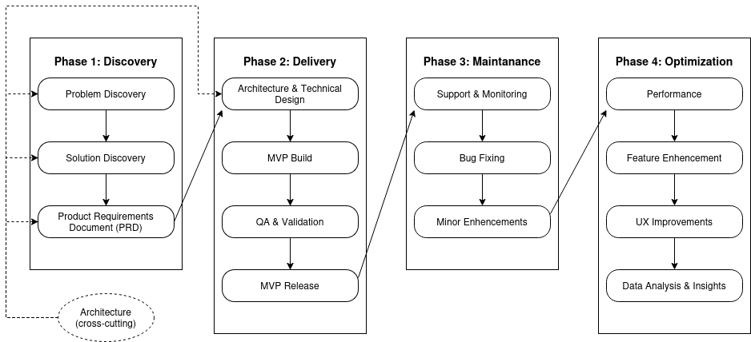
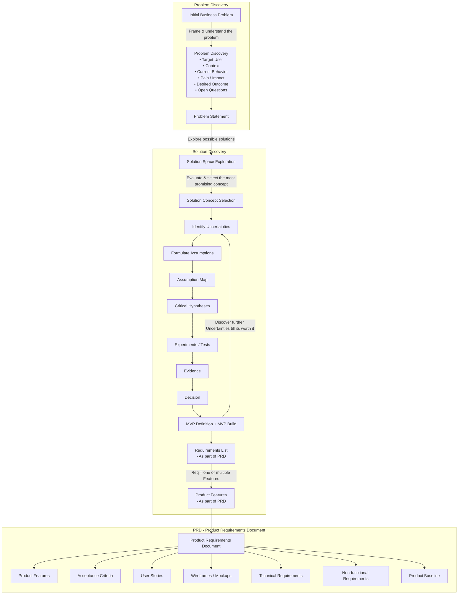
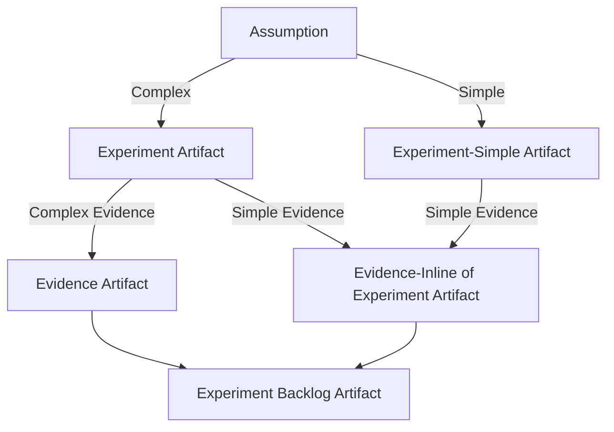
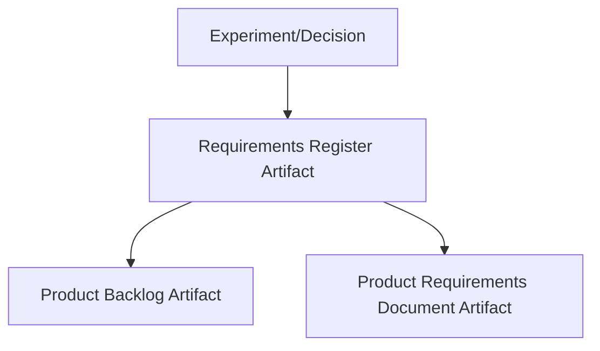

# Product Discovery Guide - Simple

## ToC
1. [Purpose](#1-purpose)
2. [Flow Diagrams](#2-flow-diagrams) 
   2.1. [SW Delivery Flow](#21-sw-delivery-flow) 
   2.2. [Discovery Flow](#22-discovery-flow) 
3. [Problem Discovery](#3-problem-discovery) 
   3.1. [Business Problem](#31-business-problem) 
   3.2. [Problem Discovery](#32-problem-discovery) 
   3.3. [Problem Statement](#33-problem-statement) 
4. [Solution Discovery](#4-solution-discovery) 
   4.1. [Solution Space Exploration](#41-solution-space-exploration) 
   4.2. [Solution Concept Selection](#42-solution-concept-selection) 
   4.3. [Uncertainties & Assumptions](#43-uncertainties--assumptions) 
   4.4. [Experiments](#44-experiments) 
   4.5. [Decisions Record](#45-decisions-record) 
5. [Product Requirements Document (PRD)](#5-product-requirements-document-prd) 
    5.1. [Requirements Register](#51-requirements-register) 
    5.2. [Product Backlog](#52-product-backlog) 
    5.3. [Product Requirements Document (PRD)](#53-product-requirements-document-prd) 
6. [Risk Management](#6-risk-management)

## 1. Purpose
This is a simplified guide to product discovery. It is designed to help me quickly understand the key steps in the product discovery process and how to apply them in practice.

### Usage:
This document is intended to describe the process `flow` as well as usage of `artifacts and templates` for each step of the process.

#### Artifacts and Templates location:
- **Architecture related:** `docs/product/architecture/templates`
- **Product Discovery related:** `docs/product/discovery/templates`

The Artifact and Template are copy/paste to relevant project folder and modified to fit the project context. The original template is `not modified`.

---

## 2. Flow Diagrams

### 2.1 SW Delivery Flow
See the High-level flowchart of the SW Delivery process below. Notice that `Architecture` is cross-cutting activity.

### 2.2 Discovery Flow

## 3. Problem Discovery

### 3.1 Business Problem

Used to discover the problem from the business perspective.

**Template:** `docs/product/discovery/templates/01-problem-framing/BP-XXX-business-problem-[template].md`

---

### 3.2 Problem Discovery

Used to discovery the problem from the technical/user perspective.

**Template:** `docs/product/discovery/templates/01-problem-framing/PDS-XXX-problem-discovery-[template].md`

---

### 3.3 Problem Statement

Used to summarize the problem discovery results into a concise statement. Use it only when the problem is complex and requires dedicated artifact to summarize the problem discovery results. Otherwise, the problem statement should be included in the problem discovery artifact.

**Template:** `docs/product/discovery/templates/01-problem-framing/PST-XXX-problem-statement-[template].md`

---

## 4. Solution Discovery

### 4.1 Solution Space Exploration

Used to explore the solution space and identify potential solutions to the problem.

**Template:** `docs/product/discovery/templates/01-problem-framing/SSE-XXX-solution-space-exploration-[template].md`

---

### 4.2 Solution Concept Selection

Used to select the most promising solution concept candidate from the solution space exploration based on assessment criteria.

**Template:** `docs/product/discovery/templates/01-problem-framing/SCS-XXX-solution-concept-selection-[template].md`

---

### 4.3 Uncertainties & Assumptions

Used to identify the uncertainties and related assumptions. Evaluate and map the assumptions to prioritize the riskiest assumptions to focus on first. Manage and track the assumptions via backlog.

**Template:** `docs/product/discovery/templates/02-assumptions/ASL-assumption-list-[template].md` 
**Template:** `docs/product/discovery/templates/02-assumptions/ASB-assumptions-backlog-[template].md`

**Note:** After several projects, consider moving the `backlog.md to backlog.ods`.

---

### 4.4 Experiments

Used to design and execute experiments to test the assumptions and gather evidence to support or refute the assumptions. The experiments are managed and tracked via backlog.

**Template:** `docs/product/discovery/templates/04-experiments/EXP-XXX-experiment-[template].md` 
**Template:** `docs/product/discovery/templates/04-experiments/EXS-XXX-experiment-simple-[template].md` 
**Template:** `docs/product/discovery/templates/04-experiments/EVI-XXX-evidence-[template].md` 
**Template:** `docs/product/discovery/templates/04-experiments/EXB-experiments-backlog-[template].md`

**Note:** After several projects, consider moving the `backlog.md to backlog.ods`.

#### Discovery Techniques (Tools) for Experiments

Is defined as part of the experiment artifact and depends on the type of assumption and the resources available. The guide for selecting use [discovery-technique-guide.md](./discovery-technique-guide.md#toc) to help you choose the right technique.

**Common Discovery Techniques Artifact Templates:** 
Location: `docs/product/discovery/templates/03-discovery-techniques/*`
- JTBD (Jobs to be Done)
- User Journey Mapping
- Constraints Notes
- Option Sets & Solution Sketches
- Personas
- Prototypes
- Simple Measurement
- Survey
- Etc.

---

### 4.5 Decisions Record

Used to document the decisions made based on the evidence gathered from the experiments. Dedicated decision artifact is used when the decision is complex else the decision is part of the experiment artifact.

**Template:** `docs/product/discovery/templates/05-decisions/PDR-XXX-product-decision-record-[template].md`

---

## 5. Product Requirements Document (PRD)

### 5.1 Requirements Register

Used to capture the requirements from the experiments and decisions. The requirements are managed and tracked via register.

**Template:** `docs/product/discovery/templates/07-product-requirements-definition/RR-requirements-register-[template].ods`

---

### 5.2 Product Backlog

Used to manage and track product backlog items. It also tracks product by releases.

**Template:** `docs/product/discovery/templates/07-product-requirements-definition/BL-product-backlog-[template].ods`

---

### 5.3 Product Requirements Document (PRD)

Used to document the product requirements in a structured format. The PRD is used to communicate the product requirements to the stakeholders.

**Template:** `docs/product/discovery/templates/07-product-requirements-definition/PRD-XXX-product-requirements-definition.[template].md`

---
